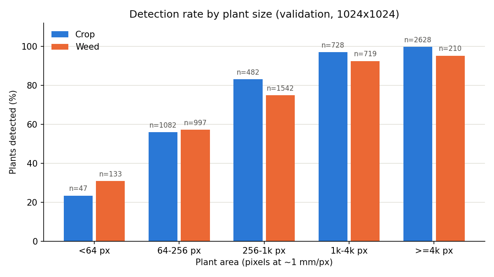

# CropSeg: UAV Crop/Weed Semantic Segmentation

A U-Net semantic segmentation model trained on the [PhenoBench](https://www.phenobench.org/) dataset to classify UAV imagery of sugar beet fields into **soil (background)**, **crop**, and **weed** pixels.

## Overview

Precision agriculture needs to know exactly where crops and weeds are in a field, so weeds can be treated selectively instead of spraying the whole field. This project trains a deep learning model to find them in drone images. Given a 1024x1024 UAV image of a sugar beet field, it labels every pixel as soil, crop or weed.

The project has three Google Colab notebooks:

1. **`notebooks/training.ipynb`** — the full training pipeline:
   - **Data** — downloads PhenoBench, merges its five labels into soil / crop / weed, and analyses the class imbalance.
   - **Training** — trains a U-Net with an ImageNet-pretrained ResNet34 encoder for 40 epochs. It uses augmentation (flips, rotations, brightness and colour changes) and a Dice + cross-entropy loss, to cope with weeds covering only ~0.5% of pixels.
   - **Evaluation** — confusion matrix, per-class IoU, a grid of predictions, and the worst-performing images.
   - **Inference** — upload any field image and get a colour-coded soil / crop / weed mask with crop and weed coverage percentages.
2. **`notebooks/evaluation.ipynb`** — evaluates the trained model without retraining. It scores at PhenoBench's native 1024x1024 resolution, cross-checks the numbers with PhenoBench's official evaluation code, and measures failures by plant size, growth stage and location. It also builds the submission file for the official test server.
3. **`notebooks/dataset_and_model_stats.ipynb`** — computes the dataset statistics (images per date, class distribution over all masks) and the model facts (what is stored in the checkpoint, number of parameters).

**Headline result:** **84.72 mIoU on the official PhenoBench test set** (hidden labels, scored by the benchmark server), with crop IoU 93.33 and weed IoU 61.57.

**Technical report:** [`report/cropseg_report.pdf`](report/cropseg_report.pdf) describes the method, results and failure analysis in detail.

## Objective

Develop a deep learning pipeline for automated crop/weed segmentation from UAV-captured field imagery — a core task in precision agriculture and plant phenomics.

## Model Architecture

| Component | Choice | Rationale |
|-----------|--------|-----------|
| Architecture | U-Net | Standard for dense segmentation with skip connections |
| Encoder | ResNet34 (ImageNet pretrained) | Good accuracy/speed tradeoff, pretrained features |
| Loss | Dice + Cross-Entropy | Dice weights each class equally, to address severe class imbalance (weeds ≈0.5% of pixels) |
| Optimizer | AdamW (lr 3e-4, weight decay 1e-4) | Decoupled weight decay |
| Scheduler | Cosine Annealing (T_max = 40 epochs) | Smooth LR decay without sudden drops |
| Input Size | 512 x 512 | Resized from 1024x1024 for GPU memory efficiency |
| Classes | 3 (Soil, Crop, Weed) | PhenoBench's 5 labels merged: partial crop → crop, partial weed → weed (the official benchmark rule) |

The model has 24.4 million parameters (21.3M in the encoder, 3.2M in the decoder), counted in `notebooks/dataset_and_model_stats.ipynb`.

## Dataset

**PhenoBench v1.1.0** — high-resolution UAV imagery of sugar beet fields ([Weyler et al., 2024](https://arxiv.org/abs/2306.04557)):
- 1,407 training and 772 validation images (1024x1024 px), from one field recorded on three dates in 2020 (05-15, 05-26, 06-05), i.e. three growth stages. The date is the filename prefix.
- 693 test images with hidden labels, scored by the benchmark server. The test set contains the 2020 field and, in addition, **a different field recorded on four dates in 2021** that never appears in training or validation.
- Captured from ~21 m altitude, giving a ground sampling distance of ~1 mm/px.

### Class Distribution (severe imbalance)

| Split | Soil | Crop | Weed | Soil : weed |
|-------|------|------|------|-------------|
| Train (all 1,407 images) | 87.7% | 11.9% | 0.50% | ~176 : 1 |
| Validation (all 772 images) | 89.9% | 9.6% | 0.53% | ~170 : 1 |

Imbalance is strongest at the earliest growth stage:

| Date | Train soil / crop / weed | Train soil : weed | Val soil / crop / weed | Val soil : weed |
|------|------|------|------|------|
| 05-15 | 96.7 / 3.1 / 0.19% | 517 : 1 | 96.8 / 3.0 / 0.13% | 744 : 1 |
| 05-26 | 88.1 / 11.5 / 0.36% | 245 : 1 | 89.8 / 9.8 / 0.37% | 244 : 1 |
| 06-05 | 73.3 / 25.6 / 1.11% | 66 : 1 | 76.4 / 22.2 / 1.45% | 53 : 1 |

Both tables are computed over all label masks in `notebooks/dataset_and_model_stats.ipynb` (numbers in [`Evaluation/dataset_and_model_stats.json`](Evaluation/dataset_and_model_stats.json)).

The EDA cell in the training notebook samples the first 200 training files in filename order. These are all from 05-15, so its output (96.4% / 3.3% / 0.2%, 448:1) describes only the earliest growth stage.

## Results

Trained for **40 epochs** on Google Colab (T4 GPU). The model takes a 512x512 input; for the 1024x1024 results, its output is upsampled to the original size and compared with the original labels.

### Official test set

Scored by the PhenoBench benchmark server ([Codabench](https://www.codabench.org/competitions/14019), submission 965250, on the public leaderboard). The test labels are hidden, so the model was never trained, tuned or selected on this data. Raw output: [`Evaluation/scoring_result.zip`](Evaluation/scoring_result.zip).

| Test subset | mIoU | Soil | Crop | Weed |
|-------------|------|------|------|------|
| **All 693 images** | **84.72** | 99.25 | 93.33 | 61.57 |
| 2020 field (same field as training) | 85.84 | 99.33 | 93.46 | 64.73 |
| 2021 field (unseen) | 75.83 | 98.30 | 92.77 | 36.43 |

By recording date:

| Date | Field | mIoU | Soil | Crop | Weed |
|------|-------|------|------|------|------|
| 2020-05-15 | 2020 | 78.06 | 99.63 | 90.29 | 44.26 |
| 2020-05-26 | 2020 | 84.29 | 98.71 | 93.60 | 60.56 |
| 2020-06-05 | 2020 | 91.00 | 98.72 | 96.32 | 77.97 |
| 2021-05-20 | 2021 (unseen) | 68.15 | 99.54 | 69.86 | 35.04 |
| 2021-05-28 | 2021 (unseen) | 85.93 | 99.34 | 90.19 | 68.27 |
| 2021-06-01 | 2021 (unseen) | 71.97 | 98.60 | 87.43 | 29.90 |
| 2021-06-10 | 2021 (unseen) | 75.32 | 97.28 | 93.90 | 34.79 |

For context, the baselines reported in the PhenoBench paper on the same test set ([published TPAMI version](https://www.ipb.uni-bonn.de/pdfs/weyler2024tpami.pdf): Table 3 for all images, supplementary Table 9 for each field):

| Test subset | Model | mIoU | Soil | Crop | Weed |
|-------------|-------|------|------|------|------|
| All images | ERFNet (PhenoBench paper) | 85.98 | 99.28 | 94.30 | 64.37 |
| | DeepLabV3+ (PhenoBench paper) | 85.97 | 99.25 | 94.07 | 64.59 |
| | **This project (U-Net + ResNet34)** | **84.72** | **99.25** | **93.33** | **61.57** |
| 2020 field (same field as training) | ERFNet | 86.70 | 99.36 | 94.46 | 66.28 |
| | DeepLabV3+ | 86.56 | 99.33 | 94.25 | 66.08 |
| | **This project** | **85.84** | **99.33** | **93.46** | **64.73** |
| 2021 field (unseen) | ERFNet | 80.11 | 98.37 | 93.61 | 48.35 |
| | DeepLabV3+ | 81.38 | 98.26 | 93.28 | 52.62 |
| | **This project** | **75.83** | **98.30** | **92.77** | **36.43** |

This model scores about 1.3 mIoU points below the paper's baselines overall, mainly on the weed class. On the 2020 field it is within 0.9 points of them; on the unseen 2021 field the gap grows to 4.3–5.6 points. All three models lose weed IoU on the new field, but this one loses the most (28 points, against 13–18 points for the baselines).

### Validation set

From [`notebooks/evaluation.ipynb`](notebooks/evaluation.ipynb), using the same checkpoint. The validation set was also used to choose the checkpoint, so these numbers are somewhat optimistic compared with the test set.

| Resolution | mIoU | Soil | Crop | Weed | Pixel accuracy |
|------------|------|------|------|------|----------------|
| **1024x1024 (official setting)** | **88.08** | 99.36 | 94.87 | 70.00 | 99.37 |
| 512x512 (as in `training.ipynb`) | 87.14 | 99.26 | 94.14 | 68.03 | 99.28 |

PhenoBench's official evaluation code (`evaluate_semantics` from the [phenobench](https://github.com/PRBonn/phenobench) package), run on the same 1024x1024 predictions, gives identical numbers: soil 99.36, crop 94.87, weed 70.00, mIoU 88.08.

By growth stage (1024x1024):

| Date | Images | mIoU | Soil | Crop | Weed |
|------|--------|------|------|------|------|
| 05-15 | 399 | 79.60 | 99.64 | 90.65 | 48.50 |
| 05-26 | 170 | 83.55 | 99.19 | 93.64 | 57.80 |
| 06-05 | 203 | 90.70 | 98.82 | 96.49 | 76.79 |

All validation numbers are in [`Evaluation/eval_results.json`](Evaluation/eval_results.json).

### How mIoU is computed

All mIoU values above use the PhenoBench definition: IoU per class from one confusion matrix over every pixel of the split, then averaged over soil, crop and weed. `training.ipynb` also logs two other averages:

| Definition | Value (validation, 512x512) | Where |
|------------|-------|-------|
| **Dataset-level** (PhenoBench definition) | **0.871** | `training.ipynb`, per-class IoU bar chart |
| Batch-averaged — IoU per validation batch, averaged over 97 batches. Used to select the checkpoint (epoch 39). | 0.822 | `training.ipynb`, training log |
| Per-image average | 0.794 | `training.ipynb`, failure analysis |

Batch and per-image averaging penalise the weed class: when a batch or image has only a few weed pixels, a handful of errors drives its weed IoU toward zero.

### Failure analysis

Measured on the validation set at 1024x1024 in `evaluation.ipynb`.

**Small plants are missed.** Each complete plant in PhenoBench's `plant_instances` counts as detected if at least 50% of its pixels are predicted as its class. Partial plants cut by the image border are excluded. At ~1 mm/px, the plant area in pixels is roughly its area in mm².

| Plant area (px) | Weed instances | Weeds detected | Crop instances | Crops detected |
|-----------------|----------------|----------------|----------------|----------------|
| < 64 | 133 | 30.8% | 47 | 23.4% |
| 64–256 | 997 | 57.3% | 1,082 | 56.0% |
| 256–1k | 1,542 | 74.8% | 482 | 83.2% |
| 1k–4k | 719 | 92.5% | 728 | 97.0% |
| ≥ 4k | 210 | 95.2% | 2,628 | 99.8% |

Counts are plant instances per image. Neighbouring PhenoBench images overlap by 50%, so the same plant can be counted in more than one image.



**Most errors are at plant outlines.** Each pixel is assigned to a zone based on the ground truth (zone width 5 px ≈ 5 mm):

| Zone | Share of pixels | Error rate | Share of all errors | Share of crop↔weed swaps |
|------|-----------------|------------|---------------------|--------------------------|
| Crop–weed contact (near both a crop and a weed) | 0.06% | 34.75% | 3.15% | 25.87% |
| Plant–soil edge | 6.03% | 9.40% | 89.77% | 47.08% |
| Plant interior | 6.99% | 0.43% | 4.77% | 27.04% |
| Open soil | 86.92% | 0.02% | 2.30% | 0.00% |

**Weeds are mostly confused with soil, not with crops.** Of the weed pixels the model missed, 71% were predicted as soil. Of the pixels wrongly predicted as weed, 71% were soil.

**The worst images are from the earliest growth stage.** Among validation images with at least 500 weed pixels, the six with the lowest weed IoU (0.00–0.05) are all from 05-15. They are nearly bare soil, and their tiny weed seedlings are either missed (predicted as soil) or predicted as crop. See [`Evaluation/worst_weed_images.png`](Evaluation/worst_weed_images.png).

### Key Findings
- Crop is segmented reliably on both test fields overall (IoU 93.5 on the 2020 field, 92.8 on the unseen 2021 field), although on the earliest 2021 date it drops to 69.9, where the baselines keep about 90. Weed is the hard class.
- The model has two main weaknesses: a new field and small plants.
- **Weak on a new field.** Weed IoU drops by 44%, from 64.73 on the 2020 test field to 36.43 on the unseen 2021 field. The paper's baselines also lose weed IoU there, but less (13–18 points, against 28).
- **Weak on small plants.** Detection rises from about 31% for weed instances under 64 px to 95% for those over 4,000 px. Accordingly, early growth stages score lowest on both validation and test.
- Errors concentrate on plant outlines: plant–soil edges are 6% of pixels but hold 90% of errors. Crop–weed contact zones have a high error rate (35%) but are rare, holding 3% of errors.

## Repository Structure

```
CropSeg/
├── notebooks/
│   ├── training.ipynb            # Training pipeline (EDA → Training → Evaluation → Inference)
│   ├── evaluation.ipynb          # Evaluation of the trained model at 1024x1024, failure analysis, test submission
│   └── dataset_and_model_stats.ipynb  # Class distribution, checkpoint details, parameter count
├── Evaluation/
│   ├── eval_results.json         # All validation results from evaluation.ipynb
│   ├── dataset_and_model_stats.json   # Results from dataset_and_model_stats.ipynb
│   ├── detection_by_size.png     # Detection rate by plant size
│   ├── worst_weed_images.png     # Worst validation images with error maps
│   └── scoring_result.zip        # Official test-set scores from the PhenoBench benchmark server
├── report/
│   └── cropseg_report.pdf        # Technical report
├── README.md
└── .gitignore
```

## Trained Weights

The trained model checkpoint (~280 MB) is hosted on Google Drive:

**[Download Trained Weights](https://drive.google.com/drive/folders/1fGvRF82Xw8xv0RZ5-UVTLnWPkJk7pJnB?usp=sharing)**

The `checkpoints` folder contains:
- `best_model.pt` — Best checkpoint (highest batch-averaged validation mIoU, epoch 39). It stores `epoch` (0-based, 38), `val_loss` (0.1437), `val_miou` (0.8225) and `config` (printed in `notebooks/dataset_and_model_stats.ipynb`).
- `epoch_10.pt` through `epoch_40.pt` — Intermediate checkpoints
- `training_curves.png` — Loss/IoU plots
- `prediction_grid.png` — Visual results

## Setup & Usage

### Option 1: Train on Google Colab

1. Open `notebooks/training.ipynb` in Google Colab
2. The notebook automatically:
   - Mounts Google Drive
   - Downloads PhenoBench (~7.6 GB, first time only)
   - Trains the model
3. To **evaluate the pretrained weights without training**:
   - Put `best_model.pt` in `MyDrive/CropSeg/checkpoints/`
   - Run Sections 1–4, skip Sections 5–6, then run Section 7 onward. Section 5 is the training cell; Section 6 is the training-curves cell, which needs the training history. Section 7 loads `best_model.pt` directly.
   - Don't run the training cell while `best_model.pt` is present. It resumes from that checkpoint, trains another epoch, and can overwrite the file.
4. Use the final "Inference on Unseen Images" cell to predict on new images

### Option 2: Full evaluation on Google Colab (no training)

1. Put `best_model.pt` in `MyDrive/CropSeg/checkpoints/` and PhenoBench in `MyDrive/CropSeg/data/phenobench/` (the training notebook downloads it there).
2. Open `notebooks/evaluation.ipynb` in Colab, select a T4 GPU runtime, and run all cells.
3. Results, figures and `submission.zip` (for the [PhenoBench benchmark server](https://www.codabench.org/competitions/14019)) are saved to `MyDrive/CropSeg/evaluation/`.
4. Optionally, run `notebooks/dataset_and_model_stats.ipynb` the same way (CPU runtime is enough) to reproduce the dataset statistics and the parameter count.

### Option 3: Local Inference Only

```bash
pip install torch torchvision segmentation-models-pytorch opencv-python numpy
```

```python
import cv2
import numpy as np
import torch
import segmentation_models_pytorch as smp

IMAGENET_MEAN = np.array([0.485, 0.456, 0.406], dtype=np.float32)
IMAGENET_STD = np.array([0.229, 0.224, 0.225], dtype=np.float32)

# Load model
model = smp.Unet(encoder_name="resnet34", encoder_weights=None, in_channels=3, classes=3)
checkpoint = torch.load("best_model.pt", map_location="cpu")
model.load_state_dict(checkpoint["model_state_dict"])
model.eval()

# Preprocess exactly as in training: RGB, resize to 512, ImageNet normalisation
image_rgb = cv2.cvtColor(cv2.imread("your_image.png"), cv2.COLOR_BGR2RGB)
h, w = image_rgb.shape[:2]
x = cv2.resize(image_rgb, (512, 512)).astype(np.float32) / 255.0
x = (x - IMAGENET_MEAN) / IMAGENET_STD
x = torch.from_numpy(x).permute(2, 0, 1).unsqueeze(0)

with torch.no_grad():
    mask = model(x).argmax(dim=1).squeeze(0).numpy().astype(np.uint8)
mask = cv2.resize(mask, (w, h), interpolation=cv2.INTER_NEAREST)

# mask values: 0=Soil, 1=Crop, 2=Weed
```

## Technologies

- **PyTorch** — Deep learning framework
- **Segmentation Models PyTorch** — U-Net implementation with pretrained encoders
- **Albumentations** — Image augmentation
- **OpenCV** — Image I/O and preprocessing
- **NumPy, scikit-learn, Matplotlib** — Metrics, confusion matrix, plots
- **PhenoBench development kit, torchmetrics** — Official evaluation code and submission validator
- **Google Colab** — T4 GPU training environment
- **PhenoBench** — UAV crop/weed segmentation benchmark dataset

## References

- Weyler, J., et al. "PhenoBench: A Large Dataset and Benchmarks for Semantic Image Interpretation in the Agricultural Domain." *IEEE Transactions on Pattern Analysis and Machine Intelligence*, 2024.
- Ronneberger, O., Fischer, P., & Brox, T. "U-Net: Convolutional Networks for Biomedical Image Segmentation." *MICCAI*, 2015.
- He, K., et al. "Deep Residual Learning for Image Recognition." *CVPR*, 2016.
